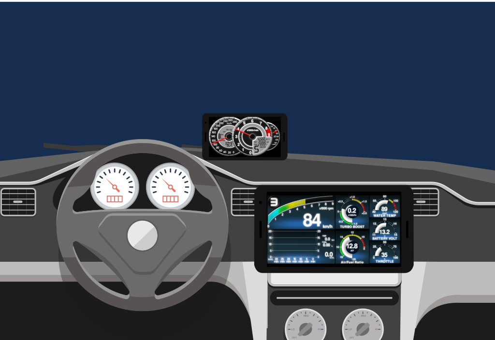
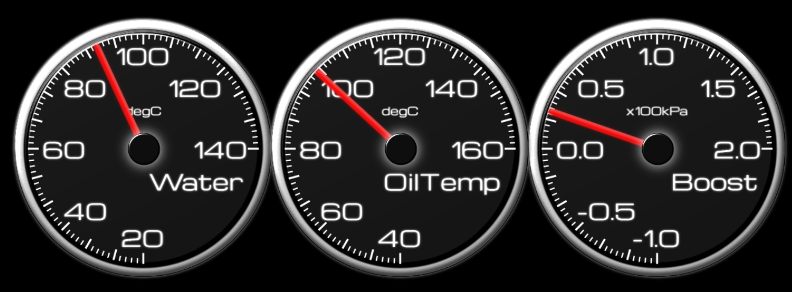
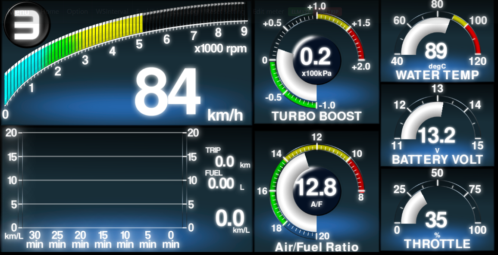
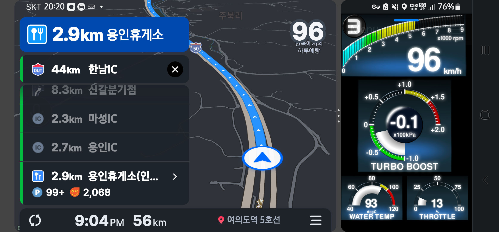
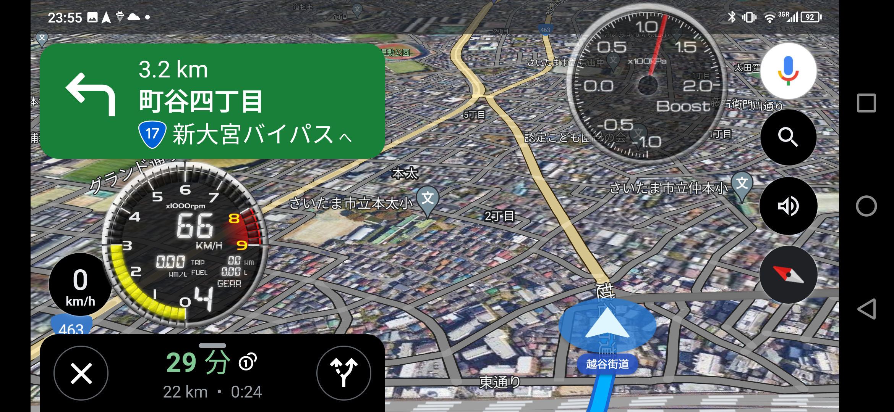

# Welcome to sugiuraii.github.io front page.

# Websocket automotive gauge project.

## 概要
* これは何？
	* 車のセンサ情報（車速・回転数・水温・ブースト等）を取得して、グラフィカルなメーターとして表示するアプリ。

* 特徴
	* センサ情報を集めて配信するサーバーと、サーバーから配信されたセンサ情報をメーターとして表示を担当するクライアントに分かれている。
	* サーバーとクライアント間の通信はWebsocketを使用。IPが通ればよいが通常は有線LANかWifiで繋げる。

* クライアント側の特徴
	* クライアントはWebアプリであり、ブラウザが動けばOSはなんでもよい（PCであってもスマホであっても）インストールも不要。
	* クライアントは複数台あってもよい（スマホを複数用意して、各々別のメーターを表示させることが可能。
	* クライアントのグラフィック表示はWebGLを使用しており、Webベースでありながら割と高速。(ほとんどpixi.jsのおかげ）
	* クライアントのjavascript(typescript)のソースコードをいじることで、自分でメーターデザインを変更することが可能。

* サーバー側の特徴
	* サーバー側もマルチプラットフォーム対応しており、.net(6.0)+asp.netが動きシリアルポートへのアクセスができれば、OSやCPUは問わない（はず）
	* Windows+x64、Linux+x64、Linux+ARMで動作確認。Raspberry Piでも動作可能。

## とりあえず試してみる.
[Quick start](WebsocketGauge/docs/QuickStart_jpn.md)を参照ください。

## メーターをデザインしてみる
こちらのレポジトリを参照ください。 [WebSocketGaugeClientNeo](https://sugiuraii.github.io/WebSocketGaugeClientNeo/).

## デモ動画.
### Demonstration on car

### Demonstration on development PC

### Arduino sensor unit demo.

### ELM327 demo (emulated on obdsim)
[]
(https://www.youtube.com/embed/l_niGjlkpQ4)

## Gallery
* アナログ3眼メーター

* Multi function display (MFD)

* メーターとカーナビ(Picture-in-picture)
	* Using Android multiple window separation feature

* メーターとカーナビ(ウィジェット)
	* メーターウィジェット化のために [Overlays](https://play.google.com/store/apps/details?id=com.applay.overlay) を使用

## リポジトリへのリンク
* [WebSocketGaugeServer](https://sugiuraii.github.io/WebSocketGaugeServer/)
	* Read the sensor information from ECU or control unit (via serial port) and broadcast the information via websocket.
* [WebSocketGaugeClientNeo](https://sugiuraii.github.io/WebSocketGaugeClientNeo/)
	* HTML5 (+WebGL or canvas) based gauge viewer (client) application.
* [ArduinoPulseSensorGeneratorReader](https://sugiuraii.github.io/ArduinoPulseSensorGeneratorReader/)
	* Arduino skethes to read speed/rpm pulse and boost/temperature voltage.
* [DefiCOM_SSMCOM_Emulator](https://sugiuraii.github.io/DefiCOM_SSMCOM_Emulator/)
	* Emulator for defi-link and Subaru select monitor (SSM). (This is useful for debugging custom gauge client application).

