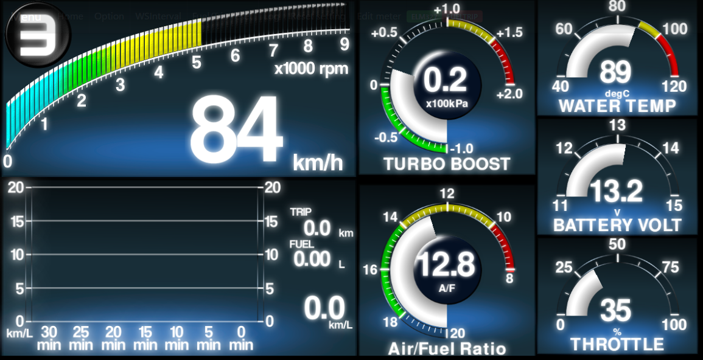

# Welcome to sugiuraii.github.io front page.

Japanese version of this document is [here](./README.ja.html)

# Websocket automotive gauge project.

## Introduction
* What is this?
	* This is an application that acquires the car's sensor information (speed, RPM, water temperature, boost, etc.) and displays them as a graphical gauge.

* Features.
	* This project(program) contains server (collects and distributes sensor information to client) and client (displaying sensor information distributed from the server as a graphical gauge).
	* Websocket is used for communication between the server and the client, usually using wired LAN or Wifi.

* Features of the client side
	* The client is a web application, which can run on any OS (PC or smartphone) as long as the browser runs, and does not require installation.
	* Multiple clients are allowed (multiple smartphones can displlay different gauges).
	* Graphic display of the client uses WebGL, which is web-based but relatively fast. (Thanks mostly to pixi.js)
	* It is possible to change the meter design by yourself by tweaking the client's javascript (typescript) source code.

* Features of the server side
	* The server side is also multi-platform compatible. As long as .net (6.0) + asp.net work and serial port access is available, OS and CPU are (should be) not cared.
	* Confirmed on Windows+x64, Linux+x64, Linux+ARM; can also run on Raspberry Pi.

## Try it.
See [Quick start](WebsocketGauge/docs/QuickStart.md)

## Design gauges
Access gauge viewer reporitory of [WebSocketGaugeClientNeo](https://sugiuraii.github.io/WebSocketGaugeClientNeo/).

## Demonstration movies.
### Demonstration on car

### Demonstration on development PC

### Arduino sensor unit demo.

### ELM327 demo (emulated on obdsim)

## Gallery
* Analog triple meter

* Multi function display (MFD)

* Meter and car navigation app, by picture-in-picture
	* Using Android multiple window separation feature

* Meter and car navigation app,by floating widget
	* Using [Overlays](https://play.google.com/store/apps/details?id=com.applay.overlay) app

## Related reporitories
* [WebSocketGaugeServer](https://sugiuraii.github.io/WebSocketGaugeServer/)
	* Read the sensor information from ECU or control unit (via serial port) and broadcast the information via websocket.
* [WebSocketGaugeClientNeo](https://sugiuraii.github.io/WebSocketGaugeClientNeo/)
	* HTML5 (+WebGL or canvas) based gauge viewer (client) application.
* [Arduino-CarSignalSensorBox](https://github.com/sugiuraii/Arduino-CarSignalSensorBox/)
	* Arduino skethes to read speed/rpm pulse and boost/temperature voltage.
* [DefiCOM_SSMCOM_Emulator](https://sugiuraii.github.io/DefiCOM_SSMCOM_Emulator/)
	* Emulator for defi-link and Subaru select monitor (SSM). (This is useful for debugging custom gauge client application).

