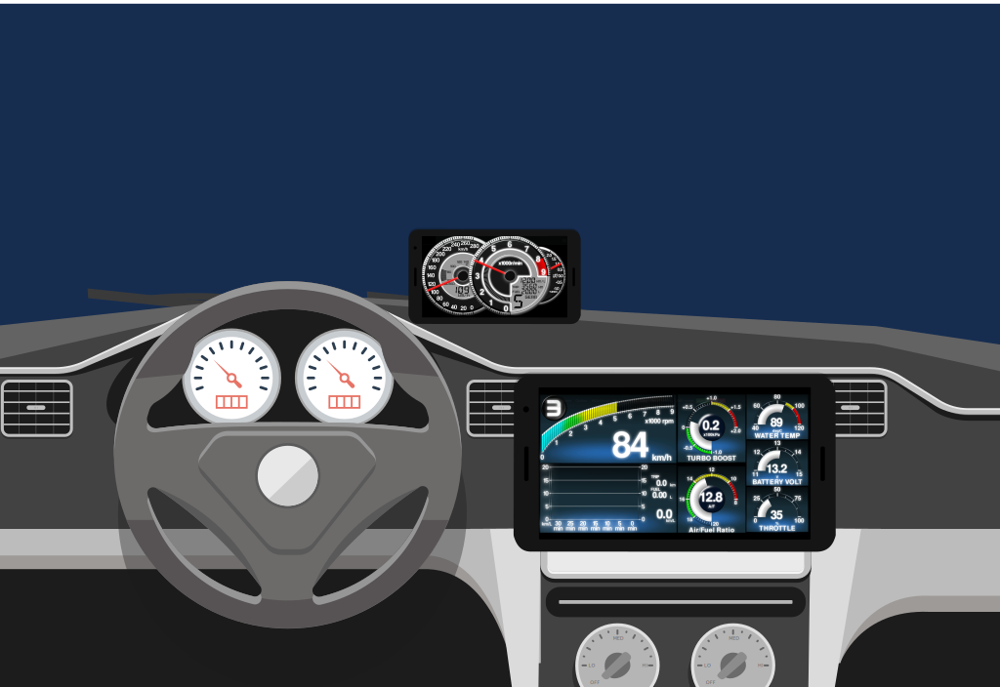
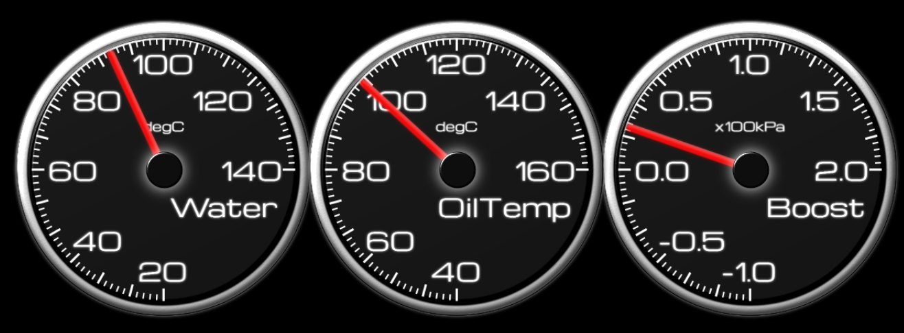
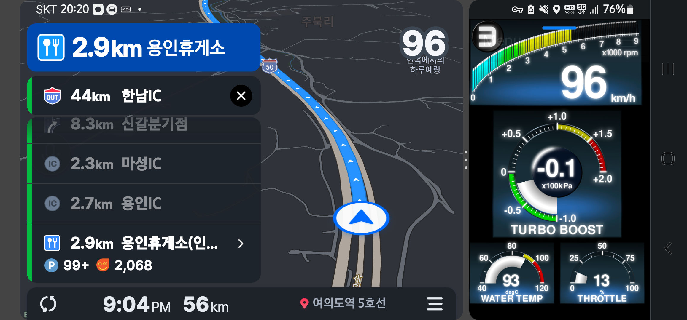

# Welcome to sugiuraii.github.io front page.

Japanese version of this document is [here](./README.ja.html)

Currently, following projects are open for development.

# Websocket automotive gauge project.

## Introduction
The goal of this project is create HTML5(canvas or websocket) based automotive gauge, by broadcasting sensor information (from ECU or sensor control unit) via websocket.

* View your car information (vehicle speed, engine rpm, boost pressure etc..) with pc or smartphone.
* Gauge viewer is purely HTML5 based. Any OS are OK, if the web browser supports HTML5 and WebGL(or canvas).
* You can design your own gauge by writing typescript.
	* Gague viewer application is coded in typescript, with using pixi.js.
* Server is writtin in C#. The server can run on both Windows and Linux (raspberry pi image is provided below.

### Try the program on raspberry pi.
Pre-installed raspbian image is available on [here](https://sugiuraii.github.io/WebSocketGaugeServer/RasobianImageSetup.html).

### Design the gauge
Access gauge viewer reporitory of [WebSocketGaugeClientNeo](https://sugiuraii.github.io/WebSocketGaugeClientNeo/).

### Demonstration movies.
#### Demonstration on car
<iframe width="640" height="360" src="https://www.youtube.com/embed/QCOYLCIrU_s" frameborder="0" allow="autoplay; encrypted-media" allowfullscreen></iframe>

#### Demonstration on development PC
<iframe width="640" height="360" src="https://www.youtube.com/embed/pAk8FpmZctI" frameborder="0" allow="autoplay; encrypted-media" allowfullscreen></iframe>

#### Arduino sensor unit demo.
<iframe width="640" height="360" src="https://www.youtube.com/embed/HvkB07k6gMc" frameborder="0" allow="autoplay; encrypted-media" allowfullscreen></iframe>

#### ELM327 demo (emulated on obdsim)
<iframe width="640" height="360" src="https://www.youtube.com/embed/l_niGjlkpQ4" frameborder="0" allow="autoplay; encrypted-media" allowfullscreen></iframe>

## Gallery
* Analog triple meter

* Multi function display (MFD)

* Meter and car navigation app, by picture-in-picture
	* Using Android multiple window separation feature

* Meter and car navigation app,by floating widget
	* Using [Overlays](https://play.google.com/store/apps/details?id=com.applay.overlay) app

### Related reporitories
* [WebSocketGaugeServer](https://sugiuraii.github.io/WebSocketGaugeServer/)
	* Read the sensor information from ECU or control unit (via serial port) and broadcast the information via websocket.
* [WebSocketGaugeClientNeo](https://sugiuraii.github.io/WebSocketGaugeClientNeo/)
	* HTML5 (+WebGL or canvas) based gauge viewer (client) application.
* [Arduino-CarSignalSensorBox](https://github.com/sugiuraii/Arduino-CarSignalSensorBox/)
	* Arduino skethes to read speed/rpm pulse and boost/temperature voltage.
* [DefiCOM_SSMCOM_Emulator](https://sugiuraii.github.io/DefiCOM_SSMCOM_Emulator/)
	* Emulator for defi-link and Subaru select monitor (SSM). (This is useful for debugging custom gauge client application).

